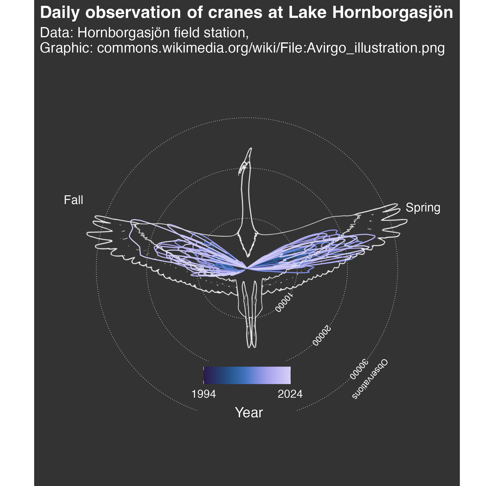

```{=html}
<div class="page-header">
  <p class="category">Data Visualisation</p>
  <h1>Data Visualisation</h1>
  <p style="max-width:600px; color:#444; margin-top:0.8rem;">
    Selected visualisation projects, I did for fun, for class, or for freelance work. The Guardian Australia featured one of my TidyTuesday visualisations on Scottish Munros in their <a href="https://www.theguardian.com/news/2025/aug/29/the-crunch-the-shrinking-space-to-exist-in-gaza-redrawing-the-world-map-and-are-there-any-safe-seats-on-a-plane" target="_blank">biweekly data-viz best-of</a> a while ago.
  </p>
</div>

<!--
  HOW TO ADD A VIZ
  ================
  Add a new object to the VIZ_ITEMS array in the script below:
    src   = path to image in assets/images/dataviz/
    title = short title shown in caption
    desc  = one-sentence description shown in caption
    gh    = GitHub repo URL (or "" to omit link)
  The first item is shown by default.
-->

<div class="viz-carousel">
  <div class="viz-main">
    <div class="viz-image-wrap">
      
    </div>
    <div class="viz-caption">
      <span id="viz-cap-title" class="viz-cap-title">TidyTuesday</span>
      <span id="viz-cap-desc" class="viz-cap-desc">Weekly data visualisation practice in R.</span>
      <a id="viz-cap-link" class="viz-cap-link"
         href="https://github.com/lucialayr/TidyTuesday" target="_blank">GitHub →</a>
    </div>
  </div>
  <div class="viz-thumbs" id="viz-thumbs" role="list" aria-label="Visualisation thumbnails"></div>
</div>

<script>
(function () {
  var items = [
    {
      src: "assets/images/dataviz/tidy1.png",
      title: "TidyTuesday",
      desc: "Weekly data visualisation practice in R.",
      gh: "https://github.com/lucialayr/TidyTuesday"
    },
    {
      src: "assets/images/dataviz/tidy2.png",
      title: "TidyTuesday",
      desc: "Weekly data visualisation practice in R.",
      gh: "https://github.com/lucialayr/TidyTuesday"
    },
    {
      src: "assets/images/dataviz/tidy3.png",
      title: "TidyTuesday",
      desc: "Weekly data visualisation practice in R.",
      gh: "https://github.com/lucialayr/TidyTuesday"
    },
    {
      src: "assets/images/dataviz/survey1.png",
      title: "Sexual Harassment Survey",
      desc: "Visualising survey data on sexual harassment at a German university. Freelance, 2023.",
      gh: "https://github.com/lucialayr/visualization_hsurvey"
    },
    {
      src: "assets/images/dataviz/survey2.png",
      title: "Sexual Harassment Survey",
      desc: "Visualising survey data on sexual harassment at a German university. Freelance, 2023.",
      gh: "https://github.com/lucialayr/visualization_hsurvey"
    },
    {
      src: "assets/images/dataviz/arabic1.png",
      title: "Arabic 20B Final Project",
      desc: "Data visualisation final project for Arabic 20B at UC Berkeley, 2026.",
      gh: "https://github.com/lucialayr/arabic20b"
    }
  ];

  var activeImg  = document.getElementById('viz-active-img');
  var capTitle   = document.getElementById('viz-cap-title');
  var capDesc    = document.getElementById('viz-cap-desc');
  var capLink    = document.getElementById('viz-cap-link');
  var thumbsWrap = document.getElementById('viz-thumbs');

  function activate(index) {
    var item = items[index];
    activeImg.src = item.src;
    activeImg.alt = item.title;
    capTitle.textContent = item.title;
    capDesc.textContent  = item.desc;
    if (item.gh) {
      capLink.href  = item.gh;
      capLink.style.display = '';
    } else {
      capLink.style.display = 'none';
    }
    thumbsWrap.querySelectorAll('.viz-thumb').forEach(function (t, i) {
      t.classList.toggle('active', i === index);
    });
  }

  items.forEach(function (item, i) {
    var btn = document.createElement('button');
    btn.className = 'viz-thumb' + (i === 0 ? ' active' : '');
    btn.setAttribute('aria-label', item.title);
    btn.setAttribute('role', 'listitem');
    var tImg = document.createElement('img');
    tImg.src = item.src;
    tImg.alt = item.title;
    tImg.loading = 'lazy';
    btn.appendChild(tImg);
    btn.addEventListener('click', function () { activate(i); });
    thumbsWrap.appendChild(btn);
  });
})();
</script>
```
