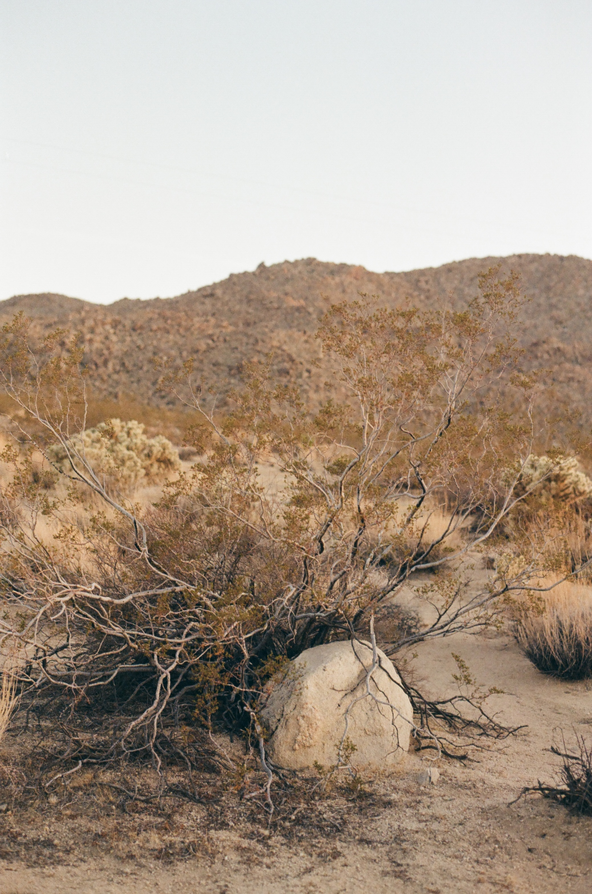
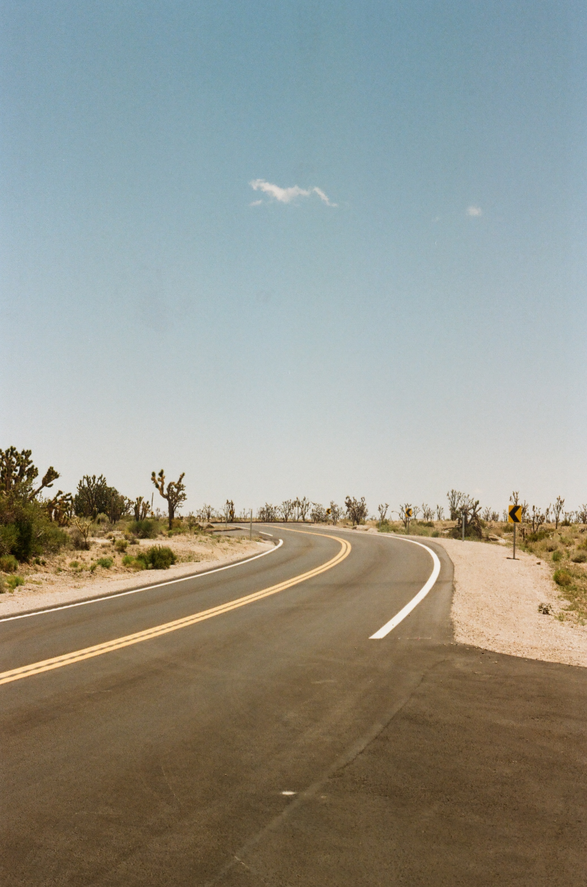
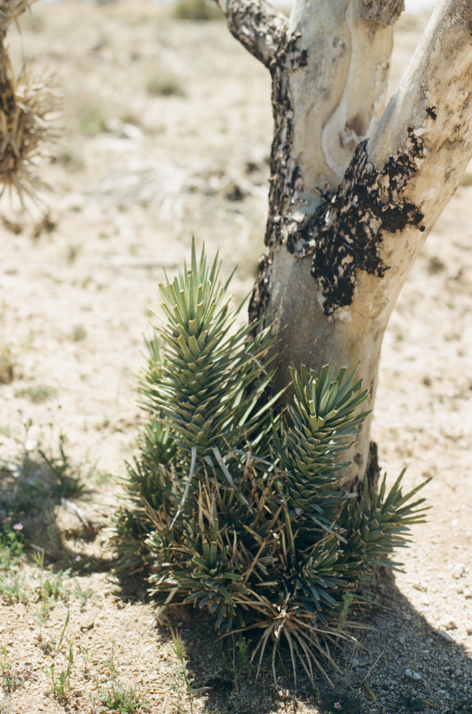

```{=html}
<div class="page-header">
  <p class="category">Photography</p>
  <h1>Photography</h1>
  <p style="max-width:600px; color:#444; margin-top:0.8rem;">
    Shot with a Canon AE1, mostly on Kodak Gold 200 film, and developed by Underdog Film Lab in Oakland, California. 
  </p>
</div>

<!-- GLightbox: lightweight lightbox -->
<link rel="stylesheet" href="https://cdn.jsdelivr.net/npm/glightbox/dist/css/glightbox.min.css"/>
<script src="https://cdn.jsdelivr.net/npm/glightbox/dist/js/glightbox.min.js"></script>

<!--
  HOW TO ADD A PHOTO
  ==================
  1. Drop the image file into: assets/images/photography/
  2. Copy one <a> block below and paste it in the desired position
  3. Set href and src to the filename, set data-title to your caption
  4. Run: quarto render
-->

<div class="masonry-gallery">

  <!-- Joshua Tree -->
  <a href="assets/images/photography/jotr1.jpg" class="glightbox" data-gallery="portfolio" data-title="Joshua Tree National Park">
    
  </a>
  <a href="assets/images/photography/jotr2.jpg" class="glightbox" data-gallery="portfolio" data-title="Joshua Tree National Park">
    
  </a>
  <a href="assets/images/photography/jotr3.jpg" class="glightbox" data-gallery="portfolio" data-title="Joshua Tree National Park">
    
  </a>
  <a href="assets/images/photography/jotr4.jpg" class="glightbox" data-gallery="portfolio" data-title="Joshua Tree National Park">
    
  </a>
  <a href="assets/images/photography/jotr5.jpg" class="glightbox" data-gallery="portfolio" data-title="Joshua Tree National Park">
    
  </a>
  <a href="assets/images/photography/jotr6.jpg" class="glightbox" data-gallery="portfolio" data-title="Joshua Tree National Park">
    
  </a>

  <!-- Sierra Nevada -->
  <a href="assets/images/photography/sierra1.jpg" class="glightbox" data-gallery="portfolio" data-title="Sierra Nevada">
    
  </a>
  <a href="assets/images/photography/sierra2.jpg" class="glightbox" data-gallery="portfolio" data-title="Sierra Nevada">
    
  </a>

  <!-- Los Angeles -->
  <a href="assets/images/photography/la1.jpg" class="glightbox" data-gallery="portfolio" data-title="Los Angeles">
    
  </a>
  <a href="assets/images/photography/la2.jpg" class="glightbox" data-gallery="portfolio" data-title="Los Angeles">
    
  </a>

  <!-- Mexico City -->
  <a href="assets/images/photography/cdmx1.jpg" class="glightbox" data-gallery="portfolio" data-title="Mexico City">
    
  </a>
  <a href="assets/images/photography/cdmx2.jpg" class="glightbox" data-gallery="portfolio" data-title="Mexico City">
    
  </a>

  <!-- New York -->
  <a href="assets/images/photography/nyc1.jpg" class="glightbox" data-gallery="portfolio" data-title="New York">
    
  </a>
  <a href="assets/images/photography/nyc2.jpg" class="glightbox" data-gallery="portfolio" data-title="New York">
    
  </a>

  <!-- Munich -->
  <a href="assets/images/photography/muc1.jpg" class="glightbox" data-gallery="portfolio" data-title="Munich">
    
  </a>

</div>

<script>
  const lightbox = GLightbox({ selector: '.glightbox' });
</script>
```
