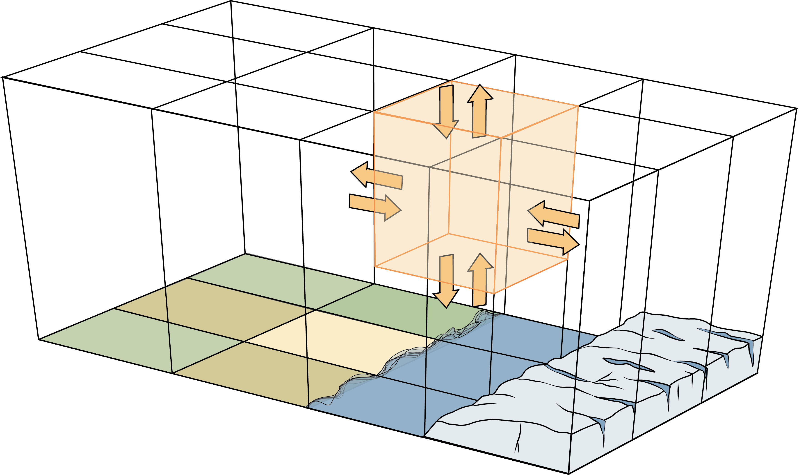

```{=html}
<div class="page-header">
  <p class="category">Communication</p>
  <h1>Communication</h1>
  <p style="max-width:600px; color:#444; margin-top:0.8rem;">
    I write, edit, and sketch about my science to a variety of audiences. I particularly care about communicating an intuition for climate science and modeling without using a lot of maths. 
  </p>
</div>
```
### Book on *Klimamodellierung verstehen* (Understanding Climate Modeling)

I co-wrote and illustrated a popular science text book on climate modeling, to be published in German by Springer Nature in Summer of 2026. The book is intended for a general audience, and covers the basics of climate modeling, how models work, and what they can and cannot do. Fingers crossed for an English edition in the future!

{style="max-width:70%; margin: 1.2rem 0;"}

### Editor-in-Chief — EGU Biogeosciences Blog


Since 2024, I am serving as the Editor-in-Chief for the European Geosciences Union's [Biogeosciences Division blog](https://blogs.egu.eu/divisions/bg/){target="_blank"}. I lead a team of four topical editors to maintain the blog as a space for and by the Biogeosciences community.
If you're interested in [writing for the blog](https://blogs.egu.eu/divisions/bg/2026/01/15/writing-for-the-bg-blog/), please reach out to me at [lucialayr@berkeley.edu](mailto:lucialayr@berkeley.edu).

---

### Public Writing
**The existential modelling crisis – and how to overcome it** A reflection of modeling as a scientific practice, and how approach it as a PhD Student. GeoLogs, 2025. [https://blogs.egu.eu/geolog/2025/09/05/the-existential-modelling-crisis-and-how-to-overcome-it/](https://blogs.egu.eu/geolog/2025/09/05/the-existential-modelling-crisis-and-how-to-overcome-it/){target="_blank"}

**"Was unterm Strich zählt"** *(What counts in the end)*  
*politische ökologie/ political ecology*, issue 02/2020  
A lifecycle analysis of plastic emissions — examining what the numbers actually mean for policy and production.

